# Reggit 機能・動作説明書

会員・注文・予約・特典が何を目的に提供され、顧客・店舗・外部サービスの間でどう動くかをまとめた説明書です。店舗運用担当者、企画担当者、開発者の共通資料として使います。

## 目次

| 読みたいこと | 章 |
|---|---|
| 目的・利用者・店舗ごとの情報範囲 | [1. 全体像](#overview) |
| 登録・プロフィール・ポイント・ランク・引継ぎ・退会 | [2. 会員](#members) |
| 商品・注文・決済・予約・順番待ち・店舗端末・回数券・サブスク・ショップ運用 | [3. 店舗利用](#store-flows) |
| 特典・配信・分析・外部連携・導入登録 | [4. 特典と再来店](#benefits) |
| 保存のタイミング・処理順・失敗時の分岐 | [5. シーケンス図](#sequences) |

## 仕様・意図・確認範囲

**実装確認**はソースコードで確認した動作、**既存資料の方針**はプロダクト・運用資料に記録された目的、**意図の推定**は実装から読み取った理由です。推定は当初の企画者の意思決定を保証しません。

確認日は2026-10-12（日本時間）。初版の主要業務仕様は `acacdc53b2450b01c485fd3e077bd6da3a4d984a` を基準に調査し、この統合版の導入登録部分は `a441716fe` を基準とする今回の変更を含みます。実店舗の設定値・契約状況・実データ、外部APIの実接続は確認していません。設定できる機能と現在有効な機能は異なります。

入力項目の全制約、全HTTP応答、LIFFとネイティブの全画面差分、管理画面の全操作手順は未網羅です。API契約は [APIルート](../routes/api.php)、[画面ルート](../routes/web.php)、対応するFormRequestを参照してください。シーケンス図は主要処理の要約で、内部の全メソッドや例外を表しません。

本文の関連テストへのリンクは検証先の案内です。今回のリリースのテスト・CI・デプロイ結果はPRに記録します。仕様調査自体の実DB・外部API検証と、変更に対するリリース検証を区別します。

## 仕様変更時の更新

1. 対象機能の動作・例外・具体例を更新します。
2. 保存・外部連携・再試行の順序が変わったら図も更新します。
3. 企画意図が本人の説明で確定したら、推定の表示を確認済みに変えて根拠と日付を記録します。

技術構成は [アーキテクチャ](ARCHITECTURE.md)、詳細な運用は [運用](OPERATIONS.md)、障害復旧は [配信の再試行](DELIVERY_RELIABILITY.md) を参照してください。

<a id="overview"></a>

## 1. 全体像と機能の目的


<a id="overview-01"></a>

### 1. 何を実現するアプリか

**既存資料の方針：** 会員証・注文・予約・順番待ちで来店体験を便利にし、会員・来店・購買情報を特典や案内につなげて再来店を支援します。店舗が専任の分析担当者なしでも運用でき、不要な機能を無効にできることを重視します。

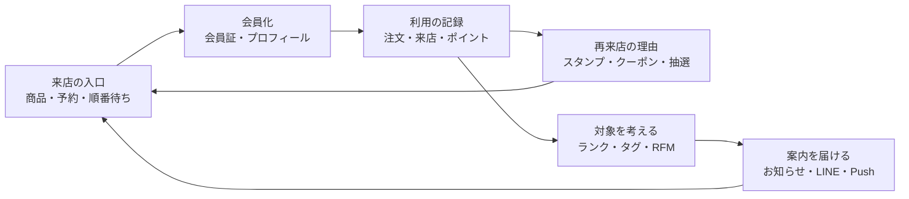
```mermaid
flowchart LR
    A[来店の入口\n商品・予約・順番待ち] --> B[会員化\n会員証・プロフィール]
    B --> C[利用の記録\n注文・来店・ポイント]
    C --> D[再来店の理由\nスタンプ・クーポン・抽選]
    C --> E[対象を考える\nランク・タグ・RFM]
    E --> F[案内を届ける\nお知らせ・LINE・Push]
    D --> A
    F --> A
```

この図はプロダクトの価値の流れです。会員登録→注文→通知を必ず順番に実行する処理図ではありません。


<a id="overview-02"></a>

### 2. 利用者と入口

| 利用者 | 入口・役割 | できること |
|---|---|---|
| 顧客 | LINE の LIFF、店舗のネイティブアプリ | 会員証、商品、注文、予約、受付、特典、お知らせ |
| 店舗担当者 | 店舗管理画面 | 会員検索、注文対応、予約管理、受付対応、許可された設定・配信 |
| 本部担当者 | `project_admin` | プロジェクト内の全店舗、共通設定、担当者管理 |
| システム管理者 | システム管理画面 | プロジェクト、アカウント、APIトークン、全体監査 |
| 店舗端末 | Kitchen / Waiting の iPad アプリ | 登録した1店舗の注文対応または順番待ち対応 |

店舗担当者の `admin` は担当店舗、`staff` は担当店舗と機能別権限の両方で制限されます。スタッフ以外でもテナント・担当店舗・プランの制約は残ります。

**意図の推定：** 顧客には短い操作経路を提供し、店舗には現場対応、本部には共通施策の管理を分担させています。顧客の利用端末とスタッフの操作端末を別に扱い、店頭受付を会員登録の有無に左右されず運用できるようにしています。


<a id="overview-03"></a>

### 3. プロジェクトと店舗の違い

`Project` は契約・ブランド・LINE/LIFF・会員基盤の単位です。`Store` はその配下の実店舗です。「同じ店舗グループ」と「別契約の店舗」を混同しないための境界です。

| 情報 | 持つ単位 | 例 |
|---|---|---|
| 会員番号、会員証、ポイント残高、ランク | プロジェクト共通 | 同一ブランドのA店・B店で同じ会員証を使う |
| 商品・価格・在庫・特典定義・タグ | プロジェクト共通 | 現在は店舗別の価格・在庫を標準提供しない |
| 注文・予約・受付・来店・取引履歴 | 利用店舗 | A店の予約をB店の予約枠へ混ぜない |
| 利用店舗の関係 | 会員と店舗の組 | 支店が閲覧できる会員を制限する |
| 営業時間・注文モード・予約枠・受付設定 | 店舗で上書き可 | 未設定ならプロジェクトの設定を使う |

店舗を画面で選ぶだけでは会員の利用店舗関係を追加しません。プロフィールの「ご利用店舗」を変更しても過去の注文店舗・利用関係・共通残高は消しません。

**既存資料の方針：** 複数店舗では共通プロフィール変更・退会・商品や配信ルールなどの共通編集を本部に限定します。1店舗では従来の管理権限を維持します。本部が全店舗表示を選んでいても、注文・予約・受付の作成には具体的な店舗が必要です。


<a id="overview-04"></a>

### 4. 機能を入れている理由

| 機能 | 既存方針に沿った役割 | 意図の推定・読み取り |
|---|---|---|
| 会員証・プロフィール | 会員基盤の入口 | 店頭照合とオンライン操作を同じ会員へつなぐ |
| ポイント・ランク | 利用に応じた特典 | 継続利用の価値と次の目標を示す |
| 商品・注文・決済 | 来店体験と購買記録 | 来店前・店内の注文を店舗の対応とPOSへつなぐ |
| 予約・順番待ち | 利用の利便性 | 事前の席確保と当日の受付を別の仕組みで扱う |
| スタンプ・クーポン | 再来店の理由 | 達成目標と受け取った特典を見える形にする |
| 抽選 | 特典を届ける体験 | 購買や達成に演出を加え、当選後の利用へつなぐ |
| お知らせ・配信 | 対象に合った案内 | 全員への通知だけでなく条件に合う会員へ届ける |
| RFM・タグ・分析 | 専任担当者なしの施策運用 | 会員属性と利用実績から対象者を選ぶ |
| Wallet | 会員証の利用 | アプリを開く以外の提示経路を増やす |
| デザイン・ギャラリー・問い合わせ | 店舗ごとの入口 | 店舗の見せ方と顧客との連絡経路を整える |

以上は機能の役割の整理です。個々の機能を最初に採用した日や当初の意思決定は、現存資料からは確定していません。


<a id="overview-05"></a>

### 5. 共通して押さえる動作

機能が表示されるか、操作できるかは、機能設定・プラン・認証・権限・対象店舗で変わります。ホームのメニュー配置とサーバーが操作を許可する条件は別に確認します。機能設定のモデルでは主要機能は既定で有効、ガチャ・スクラッチ・ルーレットは既定で無効ですが、実店舗の保存済み設定を意味しません。

顧客本人の認証とAPIトークンは役割が違います。APIトークンが正しくても、それだけで任意の会員として操作できるわけではありません。本番のLINE本人確認はIDトークンを検証し、会員の書込みでは現在の所有者を再確認します。

DBへの保存完了、外部同期完了、通知到達は別々です。例えば注文が保存されてもスマレジ同期は後で回復する場合があり、クーポンが発行済みでも通知が未完了の場合があります。ただし明示的な会員登録や外部連携済み会員の退会には外部成功を要求する経路があり、すべての外部通信を後回しにはしていません。


<a id="overview-06"></a>

### 根拠

[プロダクト](PRODUCT.md)、[運用](OPERATIONS.md)、[アーキテクチャ](ARCHITECTURE.md)、[機能設定](../app/Models/Settings/ProjectFeatureFlags.php)、[APIルート](../routes/api.php)、[本人の現在状態の確認](../app/Services/Member/CurrentMemberPrincipal.php)。

<a id="members"></a>

## 2. 会員の仕様


<a id="members-01"></a>

### 1. 会員登録と会員証

**目的（既存方針）：** 会員・来店・購買・特典を同じデータでつなぎます。**意図の推定：** 登録モードを選べることで、店舗ごとの会員化方針と利用開始の手軽さを両立します。

| モード | 定義 | サーバー側の注意 |
|---|---|---|
| `optional` | ゲスト可能 | ログイン時に会員を自動作成する経路がある |
| `popup` | ポップアップで登録案内 | `optional` の自動作成対象ではない |
| `prompt` | 登録画面を表示、登録は任意 | `optional` の自動作成対象ではない |
| `force` | 会員必須 | 会員が必要な入口で登録を要求する |

これらは設定の意味です。ポップアップの表示頻度など全UI挙動は未確認です。また「ゲスト可能」はすべての機能が非会員で使えるという意味ではありません。予約やクーポン利用などには固有の会員条件があります。

登録はプロジェクトのプロフィール設定に従い、会員番号、初期ランク、プロフィール、通知設定を保存します。登録済みの再要求は既存会員の結果を返す経路があり、新しい会員を毎回作りません。初回登録クーポンと登録後配信の予約も登録処理に含まれます。

スマレジ契約がある明示登録では、先に会員番号と登録試行キーをローカルで予約し、外部会員を作成または回復します。外部成功を得られなければ明示登録は完了しません。契約がなく未完了試行もなければローカルだけで登録する経路です。

外部会員ができた直後に通信が切れた場合、再試行は予約した番号と登録マーカーの両方を照合します。番号一致だけで別人の外部会員を引き取りません。ローカル確定時は会員と特典を同じトランザクションで保存し、外部と紐付いた試行を削除します。契約変更やマーカー不一致は管理者の確認が必要です。

`optional` の自動登録は外部の不明瞭な失敗後でもローカル登録を完了できる経路があります。会員参照時に既に作成された外部会員の紐付け回復を試みますが、参照だけで外部会員を新規作成しません。

会員情報には残高・ランク・次ランク情報・有効期限情報・会員証デザイン・項目設定を含みます。ネイティブのホーム会員コードは登録済み会員に表示します。会員情報の取得は完全な読み取りだけではなく、外部ポイント同期や台帳整合の処理を伴う場合があります。

**根拠：** [MemberService](../app/Services/MemberService.php)、[登録UseCase](../app/UseCases/Member/MemberRegisterUseCase.php)、[登録モード](../app/Enums/MemberRegistrationMode.php)、[登録回復の詳細](MEMBER_REGISTRATION_RECOVERY.md)。図：S01。


<a id="members-02"></a>

### 2. プロフィール

**目的（既存方針）：** 顧客に取得情報の理由を説明できる運用にします。**意図の推定：** 店舗が必要な情報だけを項目設定で選び、共通プロフィールとPOS会員情報を揃える仕組みです。

有効項目、ラベル、必須、入力形式、選択肢、順序はサーバー設定から提供します。標準項目とカスタム項目を扱い、プロフィール画像は専用のアップロード・削除経路です。設定の全項目を常に顧客に入力させるわけではありません。

氏名・電話・メールなどは利用者、住所・誕生日・追加項目などは会員側の情報として保存する箇所があります。操作時に現在の会員所有者を確認し、引継ぎ前の古い認証で別の所有者の情報を更新しないようにします。更新と外部同期の詳細は項目別の処理に依存します。

「ご利用店舗」（旧称: 対象店舗、`customer_store_id`）はプロフィール属性で、アプリの注文・メニューに使う店舗と同じものとして扱います（2026-10-28 ユーザー指示）。店舗が複数あるプロジェクトでは、項目設定に関係なくプロフィール編集の先頭に表示し、変更するとネイティブアプリの店舗も切り替えて読み込み直します。起動時もプロフィールの値をアプリの店舗に反映します。保存すると利用店舗関係（`member_stores`）が追加されるため、その店舗向けのお知らせが届くようになります。取引店舗・過去の利用店舗関係とは区別します。スマレジへはローカル店舗IDを外部店舗IDへ変換し、対応不明なら外部IDを送らず、受信でも既存値を上書きしません。

**根拠：** [項目ルール](../app/Services/MemberProfileRules.php)、[更新UseCase](../app/UseCases/Member/MemberUpdateUseCase.php)、[対象店舗変換](../app/Services/CustomerStoreProfile.php)、[運用](OPERATIONS.md)。


<a id="members-03"></a>

### 3. ポイントと履歴

**目的（既存方針）：** 購買と特典をつなぎます。**意図の推定：** 残高だけでなく付与・利用・返却の台帳を持つことで、取消や外部同期の根拠を追えます。

注文の利用ポイントは商品・オプションの合計金額を超えられず、ポイント機能が無効なら利用できません。残高不足も拒否します。注文金額は「商品・オプションの合計 − 利用ポイント」で、現在の計算では1ポイントを1円相当として減算します。

注文由来の獲得ポイントは、機能が有効で会員が存在する場合、次の式です。

```text
獲得ポイント = 注文ごとの固定付与 + floor(ポイント利用後の金額 / ランクに応じた付与単価)
```

例えば商品合計1,200円、利用200ポイント、固定付与2、付与単価100円なら、金額由来10＋固定2＝12ポイントです。例の数値は設定例で、既定値を示していません。付与に設定された有効日数を記録し、参照・更新時の台帳整合と期限処理に基づいて残高を表示します。

オンライン決済は注文作成時に利用分を消費し、獲得分は決済確定後です。未決済取消では利用分を返却し、在庫を戻します。現金注文の獲得・来店・スタンプは作成時、抽選権利は完了時であり、すべての特典が会計完了後ではありません。

店舗のポイント付与QRは、有効期限・総利用上限・同じ会員の受取済みを確認します。同じQRから同じ会員が繰り返し受け取ることはできません。付与と受取履歴を同時に保存します。

**根拠：** [OrderService](../app/Services/OrderService.php)、[OrderRewardService](../app/Services/OrderRewardService.php)、[ポイントQR](../app/Services/Member/PointQrRedeemer.php)、[台帳計算](../app/Domain/Member/Services/PointLedgerBalanceCalculator.php)。図：S02、S03、S04。


<a id="members-04"></a>

### 4. ランク

**目的（既存方針）：** 利用状況を特典・案内に活用します。**意図の推定：** 次の目標を示し、利用状況に合う特典を届けるための分類です。

ランクの閾値、表示、ポイント付与単価、集計方法は設定に依存します。「通常集計のポイント指標」は表示ポイント、「期間集計のポイント指標」は期間内の獲得・調整・取消台帳の合計を0以上に丸めた値です。期間集計で利用による減算を直接合算しないため、残高とランク評価値が一致しない場合があります。

スタンプ指標は通常集計なら合計スタンプ、期間集計なら期間内の台帳差分合計です。期間の開始日は設定日数前の日の開始です。ランク判定には在籍日数なども関わり、ランク低下を防ぐガードもあるため、指標が下がれば必ず即時降格するとは扱いません。昇格履歴と次ランクへの進捗を会員情報として返します。

**根拠：** [指標計算](../app/Services/MemberRankMetricCalculator.php)、[ランク判定](../app/Domain/Member/Services/MemberRankResolver.php)、[降格ガード](../app/Domain/Member/Services/MemberRankDownGuard.php)、[ランク計算](../app/Services/MemberRankCalculator.php)。


<a id="members-05"></a>

### 5. 既存会員連携・引継ぎ・退会

| 操作 | 対象と違い | 主要条件 |
|---|---|---|
| 既存会員連携 | スマレジの既存顧客とReggitを接続 | 機能有効、契約、識別項目一致、重複連携なし |
| 会員引継ぎ | Reggit会員への利用チャネルを引き継ぐ | 会員ID＋8文字コード、30分以内、未使用 |
| 退会 | 利用者と会員の利用を終了 | 現在の所有者確認、連携済みなら外部削除成功 |

認証済み利用者の既存会員連携では、POS顧客に登録されたメールへ確認を送ります。30分以内に確認し、契約と申請者を再検証します。メール未登録や別会員への連携済みは拒否します。認証利用者を伴わない管理側の連携経路には、識別項目によりメール確認と即時連携の分岐があります。顧客の番号入力だけで自由に既存会員へ接続できるという仕様ではありません。

引継ぎコードはハッシュ保存し、再発行で前の未使用コードを失効させます。コード使用時は現在の認証世代も確認します。LINE・ネイティブ端末を会員へ結び直す処理であり、異なるプロジェクトのポイントや会員を統合する機能ではありません。

退会は会員・利用者のソフトデリートです。スマレジ契約と外部顧客IDが揃う場合、外部顧客削除を先に行い、失敗ならローカル退会を完了しません。ローカルではトークン削除を試み、LINE識別子を解放し、コントローラーでセッションを消します。DB履歴がすべて物理削除されるという意味ではありません。

**根拠：** [既存連携申請](../app/UseCases/Member/RequestExistingMemberLinkUseCase.php)、[確認](../app/UseCases/Member/ConfirmExistingMemberLinkUseCase.php)、[引継ぎ発行](../app/UseCases/Member/IssueMemberTransferCodeUseCase.php)、[引継ぎ受取](../app/UseCases/Member/ClaimMemberTransferCodeUseCase.php)、[退会](../app/UseCases/Member/MemberWithdrawUseCase.php)。図：S05、S06。


<a id="members-06"></a>

### 関連する検証先

[登録回復](../tests/Feature/MemberRegistrationRecoveryTest.php)、[登録競合](../tests/Feature/MemberRegistrationConcurrencyTest.php)、[引継ぎ整合](../tests/Feature/MemberTransferConsistencyTest.php)、[登録モード](../tests/Feature/ProfileSettingsMemberRegistrationModeTest.php)。この一覧自体は合格結果を意味しません。

<a id="store-flows"></a>

## 3. 店舗利用の仕様


<a id="store-flows-01"></a>

### 1. 商品と注文

**目的（既存方針）：** 顧客の来店体験を簡単にし、購買情報を会員施策へつなぎます。**意図の推定：** 店舗の注文モードと商品設定をサーバーで確認し、画面が古い場合でも不正な価格・在庫で注文を受けない仕組みです。

商品検索・詳細を取得し、数量とオプションを選んで注文します。サーバーは送られた価格をそのまま採用せず、現在の商品価格と選択オプションの加算額から単価を作ります。商品利用可否・在庫・オプション選択制約を検証し、注文明細には商品名や価格を保存します。

| 注文設定 | 利用できる顧客注文 |
|---|---|
| `both` | モバイル注文と店内注文 |
| `mobile_only` | モバイル注文のみ |
| `in_store_only` | 店内注文のみ |

店内注文は後払いの現金、モバイル注文はStripeまたは現金を扱います。選べる決済ブランドは設定と注文経路に依存します。注文を作成するトランザクションで店舗を確定し、注文・明細・在庫減算・利用ポイントを保存します。商品・在庫は現在プロジェクト共通です。

**金額の制約：** 利用ポイントは商品合計以下、オンライン決済の最終金額は1円以上です。PayPayには最終金額50円〜100万円の実装上の制限があります。これは現行コード内の条件であり、提供元の最新制限を外部検証したものではありません。

**根拠：** [OrderService](../app/Services/OrderService.php)、[注文可否](../app/Domain/Order/Policies/OrderPlacementPolicy.php)、[オプション選択](../app/Domain/Order/Policies/ProductOptionSelectionPolicy.php)、[在庫・利用可否](../app/Domain/Order/Policies/ProductAvailabilityPolicy.php)。図：S02、S03。


<a id="store-flows-02"></a>

### 2. 決済・対応状態・取消

#### 特典と番号を確定するタイミング

| 処理 | Stripe注文作成時 | Stripe決済確定時 | 現金注文作成時 | 現金注文完了時 |
|---|---|---|---|---|
| 注文・在庫確保 | 実行 | 再確保しない | 実行 | 再確保しない |
| 注文番号 | 未採番 | 未採番なら採番 | 採番 | 既存を使う |
| ポイント利用 | 消費 | 重複消費しない | 消費 | 重複消費しない |
| 獲得ポイント・来店・スタンプ | 未付与 | 条件に応じて付与 | 条件に応じて付与 | 作成時分を重複付与しない |
| 購買由来の抽選権利 | 未付与 | 条件に応じて付与 | 未付与 | 条件に応じて付与 |

初回注文特典は「完了注文が初めて1件になった時」に発行する処理です。初回登録特典とは別です。

#### オンライン決済の確認

Intent / Checkoutを作成し、決済を行い、サーバーで決済結果を確認します。サーバーは本人の注文、外部決済の成功、通貨JPY、注文ID、金額、必要に応じてプロジェクト・決済設定のmetadataを照合します。画面が成功を表示しただけでは注文確定の根拠になりません。

フロント確認とStripe Webhookは両方から決済確定に到達します。注文をロックし、確定済みなら状態の重複更新を避け、特典も既存の記録を確認して付与します。Webhookは署名を検証して受信し、注文に保存されたプロジェクト・店舗を使います。

Webhookだけで決済確定した場合、スマレジ取引作成の要求を20秒後から実行可能な状態で保存します。毎分の回復処理が実行するため、必ず20秒で同期完了するわけではありません。フロント確認が到着すると、処理権未取得の遅延要求を即時処理へ前倒しする経路があります。

#### 対応状態

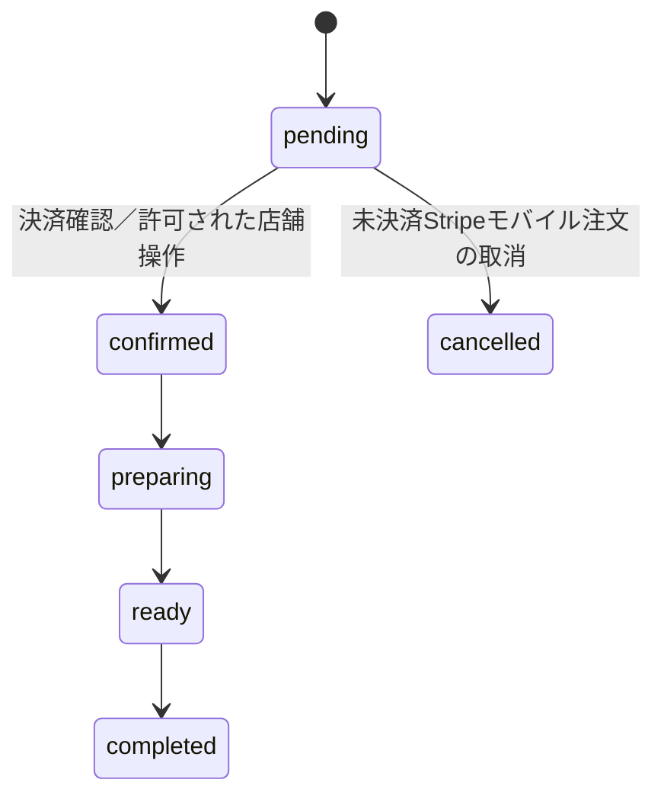
```mermaid
stateDiagram-v2
    [*] --> pending
    pending --> confirmed: 決済確認／許可された店舗操作
    confirmed --> preparing
    preparing --> ready
    ready --> completed
    pending --> cancelled: 未決済Stripeモバイル注文の取消
```

図は標準的な順番です。管理・Kitchen共通の実装は前の状態へ戻す操作を拒否しますが、前方への状態省略は許可します。同じ状態の再指定は変更なしです。Stripeの未決済 `pending` はスタッフ操作では先へ進められません。取消済み注文は再開できません。

#### 未決済取消とPOS返品の違い

顧客の未決済取消は、Stripe・モバイル・未進行の注文が対象です。外部の未決済セッション取消とローカル状態変更を扱い、利用ポイント返却・在庫復元を行います。決済済み注文のStripe返金を自由に行う機能としては扱いません。POS由来の会計キャンセル・返品は別の受信同期経路で特典を戻します。

**意図の推定：** 決済済み注文を未決済扱いで消さず、注文対応の進捗と決済の事実を整合させるための制約です。

**根拠：** [決済確認](../app/UseCases/Payment/PaymentConfirmUseCase.php)、[Webhook](../app/UseCases/Payment/PaymentWebhookUseCase.php)、[注文集約](../app/Domain/Order/Aggregates/Order.php)、[状態更新](../app/Services/OrderStatusService.php)、[未決済取消](../app/Services/UnpaidOrderCancellationService.php)、[特典処理](../app/Services/OrderRewardService.php)。図：S03、S04。


<a id="store-flows-03"></a>

### 3. 予約

**目的（既存方針）：** 来店前の利用を便利にします。**意図の推定：** 営業日・時間枠・受付上限を共通の判定で扱い、一覧に空きが見えても確定時にはもう一度確認する仕組みです。

顧客は人数を選ぶと、その人数が入る空き日・時間枠と有効なコースを取得し、表示された枠から日時を選びます（LINE・ネイティブアプリとも自由入力はしません）。作成時は現在の利用者と会員を確認し、対象店舗をロックしてから空きを再判定します。保存には店舗、予約番号、日時、人数、状態、コース名・価格の情報を含みます。

受付ルールは予約設定で決め、複数店舗では店舗ごとに上書きできます。既定値は従来と同じ動作です。

| 項目 | 現在の判定 | 既定値 |
|---|---|---|
| 予約可能日 | 当日予約を受け付けるなら当日から、受け付けないなら翌日から、設定した日数先まで | 翌日から30日先 |
| 受付締め切り | 時間枠の開始より指定した分数前まで。過ぎた枠は空き枠に出さない | 予約時刻まで |
| 営業・休業 | 対象日が利用可能であること | － |
| 時間 | 設定された時間枠と一致すること | － |
| 枠の上限 | 同時間枠の `pending` / `confirmed` の予約件数、または人数の合計（設定で選ぶ） | 件数 |
| 1件の最大人数 | 設定した人数まで | 10名 |
| 変更時 | 変更する予約自身を枠から除外する | － |
| 会員の変更・キャンセル | 予約時刻の指定時間前まで。過ぎたら店舗への連絡を案内する。管理画面からはいつでも変更できる | 予約時刻まで |

予約一覧 API は予約ごとに `change_deadline`（締め切り時刻）と `can_change`（いま変更・キャンセルできるか）を返し、空き枠 API は `number_of_people` で人数が入る枠に絞り、`max_party_size` と `change_deadline_hours` を返します。

状態は予約待ち・予約確定・キャンセル・完了です。顧客はキャンセル済み・完了済みを編集・取消できません。管理側の状態指定は顧客操作と異なるため、注文のような一方向の状態規則を予約全体へ適用してはいません。

**予約リマインド：** 予約設定の「予約リマインド」で、1回目・2回目をそれぞれ1・3・6・24・48時間前から選ぶと（例: 前日と3時間前）、15分ごとの処理が予約待ち・予約確定の予約へ、会員本人宛てのお知らせとLINEで送ります。本文は `{店舗}` `{日時}` `{人数}` `{コース}` `{詳細}` を使って書き換えられ、空欄なら標準の本文です。複数店舗では予約の店舗の設定を使います。送信済みは予約の `reminder_sent_at`・`second_reminder_sent_at` で回ごとに判定し、その時間より後に入った予約には、その回は送りません。予約日時を変えると両方とも未送信に戻ります。送信に失敗した予約は次の実行で送り直し、他の予約は止めません。会員登録していない利用者には送りません。

**根拠：** [予約作成](../app/UseCases/Reservation/ReservationStoreUseCase.php)、[空き判定](../app/UseCases/Reservation/ReservationAvailabilityService.php)、[枠Policy](../app/Domain/Reservation/Policies/ReservationSlotPolicy.php)、[集約](../app/Domain/Reservation/Aggregates/Reservation.php)、[予約永続化](../app/Infrastructure/Persistence/Eloquent/Reservation/EloquentReservationRepository.php)。図：S07。


<a id="store-flows-04"></a>

### 4. 順番待ち

**目的（既存方針）：** 当日の受付と呼出を便利にします。**意図の推定：** 店頭ゲストの受付と会員のアプリ受付を同じ待ち列で扱いながら、本人照会と店舗スタッフ操作を分けています。

顧客は人数などを入力して受付し、番号・待ち状況を確認します。店頭Waiting端末は非会員受付にも対応します。オンラインの会員必須設定とは別の経路であり、店舗端末の認証が必要です。

受付は待ち状態で作り、会員・LINE・ネイティブ端末利用者には利用者を紐付けます。店頭の使い捨てゲストには利用者IDを持たない受付もあります。日付と通番を含む保存番号と、画面の表示番号は形式が異なります。QRトークンによる照会もあります。

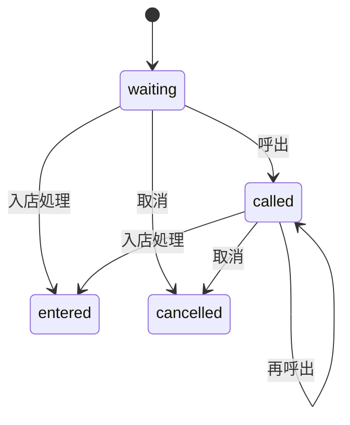
```mermaid
stateDiagram-v2
    [*] --> waiting
    waiting --> called: 呼出
    called --> called: 再呼出
    waiting --> entered: 入店処理
    called --> entered: 入店処理
    waiting --> cancelled: 取消
    called --> cancelled: 取消
```

次番呼出は対象店舗の待ち受付を更新してから通知します。再呼出は呼出済みのみで、呼出時刻を更新します。専用操作では入店済み・取消済みを再び入店処理しません。管理画面の直接状態編集にはより緩い別規則があるため、上図は専用操作の説明です。

**根拠：** [受付](../app/UseCases/Queue/QueueStoreUseCase.php)、[次番呼出](../app/UseCases/Queue/QueueCallNextUseCase.php)、[受付集約](../app/Domain/Queue/Aggregates/QueueEntry.php)、[管理・通知](../app/Services/Admin/QueueAdminService.php)、[運用](OPERATIONS.md)。図：S08。


<a id="store-flows-05"></a>

### 5. Kitchen・Waiting端末

店舗ごと・アプリ種別ごとに1台です。権限を持つ管理者が登録コードを発行し、iPadでコードと端末固有鍵を送って登録します。サーバーはコード・種別・未使用を検証し、端末用Bearerトークンを返します。コードと端末鍵はDBでハッシュ保存します。

以後はBearerトークンと `X-Device-Key` の両方、登録店舗、アプリ能力、発行管理者の現在の権限を確認します。コード再発行で旧端末は失効します。端末トークンは期限なしですが、失効・再発行・ログアウトの影響を受けます。

Kitchenは注文一覧・状態更新・Push登録、Waitingは受付一覧・呼出・再呼出・入店を扱います。Pushは登録店舗の注文に限定します。所属不明の旧端末を別店舗へ自動配属しません。

**根拠：** [端末認証Controller](../app/Http/Controllers/Api/StoreAppAuthController.php)、[APIルート](../routes/api.php)、[端末運用](OPERATIONS.md)、[iPadアプリ](../ios/README.md)。図：S09。


<a id="store-flows-06"></a>

### 6. 回数券・サブスク

**目的（2026-10-22 ユーザー指示）：** 前払いの回数券と月額サブスクで再来店を増やします。サブスクは回数券と同じ利用券の仕組みを使います。

商品編集で「回数券として販売する」を選び、利用回数と有効日数（空欄で無期限）を設定します。1日の利用上限（空欄で制限なし）は回数券・サブスク共通の商品設定で、発行時に利用券へ写します。回数券商品は通常のメニュー・ショップに表示せず、「設定 → 機能」で回数券を有効にした場合だけアプリの「回数券」画面で販売します。購入は会員だけ、オンライン決済だけです。注文種別 `ticket` の注文として作成し、決済・Webhook・スマレジ取引同期は通常のオンライン注文と同じ経路を使います。

決済確定で注文を `completed` にし、注文明細ごとに回数券を1件発行します（回数 × 数量、明細IDで重複発行を防止）。有効期限は決済確定日から有効日数後の日の終わりです。回数・有効日数は決済確定時の商品設定を使います。獲得ポイントと購買由来の抽選権利は通常どおり付与し、購入は来店ではないため来店記録とスタンプは付与しません。

お客様はクーポンと同じく、スタッフの前で「1回使う」を押します。サーバーは現在の会員と回数券をロックし、本人の券・未無効化・期限内・残り回数ありを確認して1回分を記録します。管理画面の会員詳細「回数券」で残り回数と利用履歴を確認し、利用の取消（1回分戻す）と無効化ができます。無効化は返金を伴いません。返金はStripeで別途行います。スマレジ側の返品と回数券の無効化は連動しません。

機能を無効にすると販売とメニュー表示を止めます。購入済みの回数券は `/tickets` 画面で引き続き利用できます。

**サブスク：** 商品編集で「月額サブスクとして販売する」を選び、月の利用回数（空欄で無制限）と、共通の1日の利用上限を設定します。価格が毎月の請求額です。回数券とは同時に設定できません。申し込みは会員だけ、プロジェクト別の決済設定でカードが有効な場合だけです。同じ商品の契約中サブスクがあれば重ねて申し込めません。

申し込みは Stripe Checkout の継続課金で行い、契約は決済の Webhook で作成します。毎月の `invoice.paid` で、注文種別 `subscription` の完了済み注文（スマレジ取引同期の対象）と、その請求期間の終わりまで有効な利用券を1枚発行します。請求書IDで重複発行を防ぎます。プロジェクト・決済設定・会員・商品・店舗は Checkout 作成時のメタデータとWebhookのURLで照合します。ポイントと抽選は通常どおり付与し、来店記録とスタンプは付与しません。

利用は回数券と同じ「1回使う」です。1日の上限は回数券・サブスクとも、当日（アプリのタイムゾーン）の取消されていない利用回数で判定します。解約はお客様の画面または管理画面の会員詳細から行い、Stripe に期間末の解約を予約します。状態は `customer.subscription.updated` / `customer.subscription.deleted` で反映します。決済設定の Webhook には `payment_intent.succeeded` に加えてこの3イベントを登録します。返金は Stripe で別途行います。

**根拠：** [回数券Service](../app/Services/Ticket/MemberTicketService.php)、[サブスク申込・解約](../app/Services/Subscription/MemberSubscriptionService.php)、[サブスクWebhook](../app/Services/Subscription/SubscriptionWebhookHandler.php)、[顧客API](../app/Http/Controllers/TicketController.php)、[注文可否](../app/Domain/Order/Policies/OrderPlacementPolicy.php)、[テスト](../tests/Feature/TicketPassTest.php)、[サブスクのテスト](../tests/Feature/SubscriptionTest.php)。


<a id="store-flows-07"></a>

### 7. ショップ（配送EC）の運用

**目的（2026-10-22 ユーザー指示）：** 配送ECを日本の通信販売として運用できる状態にします。

**特定商取引法に基づく表記：** 「設定 → ショップ」で販売業者・運営統括責任者・所在地・電話番号・メールアドレス・商品代金以外の必要料金・お支払い方法と時期・引渡し時期・返品とキャンセルを入力します。ショップを公開する設定では全項目が必須です。未入力の項目があると配送注文を受け付けず、ショップに準備中と表示します。表記は `/web/{project_key}/shop/legal`（独自ドメインは `/shop/legal`）で公開し、ショップのフッターとカートからリンクします。

**送料：** 商品合計（ポイント利用前）が「送料無料になる金額」以上なら送料0円、それ以外は都道府県別送料（未設定は基本送料）です。サーバーで計算し、画面の表示は同じ規則の目安です。

**お届け日時：** 有効にすると、最短お届け日（注文日からの日数）から指定期間内の日付と、登録した時間帯を選べます。指定なしも選べます。範囲外・未登録の時間帯はサーバーで拒否します。管理画面の注文詳細と購入者へのメールに表示します。

**購入者への連絡：** 配送注文の決済確定と発送で、LINE・アプリ通知に加えてメールを送ります（メールアドレスを確認済みの購入者のみ）。通知のアウトボックスにメールのチャネルを追加し、失敗時は他の通知と同じく再試行します。配送注文は厨房通知の対象外です。発送時に配送業者とお問い合わせ番号を入力すると、メールに配送状況のリンクを載せます（ヤマト運輸・佐川急便・日本郵便・西濃運輸）。

**領収書：** 決済済みの配送注文の領収書を、注文確認メールと管理画面の署名付きリンクで表示します（ログイン不要・印刷とPDF保存に対応）。商品ごとの消費税率（標準10%・軽減8%、商品編集で設定、注文時点の税率を明細に保存）で税率別の対象額と消費税額を表示し、送料は10%です。登録番号を設定すると適格簡易請求書の記載事項を満たす形になります。ポイント値引きは税率別に按分せず値引き行で表示します。返金済みの注文には無効と表示します。

**返金：** 管理画面のショップ注文詳細から全額返金できます。Stripe で返金し（注文ごとの冪等キーを使用）、注文をキャンセルにして在庫・利用ポイント・獲得ポイント・抽選権利を戻し、購入者へメールで知らせます。一部返金は Stripe の管理画面で行います。スマレジの取引は自動で取り消さないため、管理画面の案内に従ってスマレジで取消・返品します。

**根拠：** [運用設定](../app/Services/Shop/ShopOperations.php)、[返金](../app/UseCases/Shop/RefundShopOrderUseCase.php)、[領収書](../app/Http/Controllers/Shop/ShopReceiptController.php)、[通知アウトボックス](../app/Services/OrderNotificationOutbox.php)、[テスト](../tests/Feature/ShopOperationsTest.php)。


### 8. チャット

**目的（2026-10-28 ユーザー指示）：** お客様とお店が1対1でやり取りできるようにします。サーバー負荷を抑えるため、メッセージと画像は Laravel を経由せず Firebase（Firestore・Storage）に直接保存します。会話の中身は、本人の会員とその会員を担当するスタッフ以外には見えないようにします。

「設定 → 機能」でチャットを有効にすると、ネイティブアプリの「チャット」タブと管理画面の「運用 → チャット」が使えます。LINE には公式アカウントのトークがあるため、LIFF の「チャット」画面（`/chat`）は「チャット（LINE 内にも表示）」もオンのときだけ表示します（既定はオフ、2026-10-28 ユーザー指示）。オフのときは LIFF のメニュー・トークン発行から外し、返信の LINE 通知も送りません（ネイティブアプリの通知は送ります）。お客様は会員登録後に利用でき、テキスト（2000文字まで）を送れます。画像（JPEG・PNG・WebP、5MB未満）は `FIREBASE_STORAGE_BUCKET` を設定したときだけ有効で、空なら送信ボタンを出さずテキストだけで運用します。

ネイティブアプリは Firebase SDK を使わず REST API で Firestore を読み書きします。画面を開いている間だけ4秒ごとに会話ドキュメント1件を読み、新着があるときだけメッセージを取得します。ネイティブアプリからの画像送信には対応せず、届いた画像の表示だけ行います。管理画面は会員がメッセージを送った会話だけを新しい順に一覧し、未読を表示します。店舗から会話を始めることはできません。

**見える範囲：** チャットを開くたびに、Laravel が本人確認（会員）または権限確認（スタッフ）をして Firebase のログイン用トークンを発行します。読み書きできる会話はトークンの内容だけで決まり、`firestore.rules` / `storage.rules` が検証します。

- 会員: 自分の会話だけ。送信者・名前・送信時刻は偽れず、送ったメッセージは書き換え・削除できません。
- スタッフ: 権限「チャットの閲覧・返信」が必要です。会員一覧と同じ範囲で、全店舗を見られる管理者は全会話、担当店舗だけの管理者は利用店舗が重なる会員の会話だけを見られます。会話の利用店舗は、お客様がチャットを開いたときのトークンの値で更新します。
- トークンは端末に保存せず、8時間で使えなくなります。退会や権限の変更はこの時間内に反映されます。ネイティブアプリは期限切れ・拒否のたびに Laravel でトークンを取り直し、そのとき本人確認をやり直します。
- 画像は公開URLを作らず、ログイン中の本人・スタッフだけが取得して表示します。形式は端末が申告した種類と拡張子・サイズで検査し、表示は画像としてだけ行います。

保存時の暗号化は Firebase 標準（AES-256）、通信は TLS です。Firebase のコンソールに入れる管理者は内容を読めます。

**通知：** スタッフが返信すると、会員へアプリ通知と LINE で「お店からメッセージが届きました」とだけ送ります（本文は載せません）。続けて返信しても通知は会員ごとに1分1回です。お客様からのメッセージは管理画面の一覧で確認します。

**店舗への通知：** 会員が送信すると、アプリから `POST /api/member-chat/sent` で送ったことだけを知らせ（本文は送らない）、管理画面のサイドバー「チャット」に未読の会話数を出します（担当店舗の会員の分だけ）。店舗が会話を開いて読むか返信すると消えます。

**アイコン：** 管理画面は会話一覧・ヘッダー・会員の吹き出しに会員のプロフィール画像を出します（`GET /admin/{project}/chats/members`、見られる会員の分だけ）。会員側は店舗の返信の横にお店のロゴ（ロゴ画像の設定）を出します。画像がなければ頭文字を表示します。

**未読数：** 返信の数をサーバーのキャッシュで数え（会員ごと・30日保持）、アプリ通知に載せて iOS のアプリアイコンに表示します。ネイティブアプリはヘッダー・フッター・メニューのチャットにも同じ数を出し、メニューにしかない場合はメニューボタンに出します。数は起動時・アプリに戻ったとき・返信の通知を受けたときに `GET /api/member-chat/unread` で取り直し（Firebase には接続しない）、チャットを開く（トークン発行）か開いたまま返信を読む（`POST /api/member-chat/read`）と0に戻ります。LIFF で読んだ場合も同じく0になります。管理画面は未読の会話数を一覧の上とブラウザのタブ名に出します。

**編集・削除・ブロック：** 編集と削除は自分の側のメッセージだけです（会員は会員の送信、店舗は店舗側の送信。店舗も会員のメッセージは変えられません）（2026-10-28 ユーザー指示）。編集は本文だけで、送信者・時刻・画像は変えられず「編集済み」と表示します。カードと削除済みのメッセージ、ブロック中の会員は編集できません。削除は本文・画像・カードを消して「削除済み」にする書き込みだけをルールで許可し、送信者と時刻は残します（画像ファイル自体は Storage に残ります）。店舗は迷惑な会員をブロックでき、ブロック中の会員は送信できません（過去の会話は読めます）。会員は自分でブロックを外せません。

**対応忘れ防止：** 会員のメッセージに3時間返信がない会話は、管理画面の一覧で「要対応」と強調し、件数を一覧の上に出します（ブロック中は除く）。

**クーポン・予約・スタンプ：** 管理画面の会話の右の「お客様の情報」（ヘッダーのボタンで開閉、各項目も折りたたみ可）から、会員の今後の予約（予約の閲覧権限が必要）を予約カードとして送れます。クーポンは会員詳細の手動配布と同じ処理で発行し（会員の編集権限が必要）、クーポンカードを送ります。スタンプも会員詳細の「スタンプ調整」と同じ処理で1〜20個付与し、スタンプカードを送ります。カードは店舗だけが送れ、会員はカードのボタンからクーポン・予約の画面を開けます。

**リンク：** 本文中の `http://`・`https://` で始まる URL をリンクにします。それ以外の形式はリンクにしません。

**画面：** 日付の区切り（今日・昨日・日付）、時刻、相手が会話を開いた後の自分のメッセージに「既読」を表示します。ネイティブアプリはキーボードの送信キーで、管理画面は ⌘ / Ctrl + Enter で送信できます。残り200文字からは残りの文字数を表示します。

**根拠：** [トークン発行](../app/Services/Chat/FirebaseChatTokenIssuer.php)、[返信通知](../app/Services/Chat/ChatReplyNotifier.php)、[Firestoreルール](../firestore.rules)、[Storageルール](../storage.rules)、[画面共通処理](../resources/js/shared/chat/firebaseChat.ts)、[テスト](../tests/Feature/MemberChatTest.php)、[ルールのテスト](../tests/firebase/chatRules.test.mjs)、[ネイティブのクライアント](../mobile/reggit-skip/Sources/Reggit/Data/FirebaseChatClient.swift)。

<a id="store-flows-08"></a>

### 関連する検証先

[回数券](../tests/Feature/TicketPassTest.php)、[決済本人確認](../tests/Feature/PaymentPrincipalTest.php)、[決済通貨](../tests/Feature/PaymentCurrencyTest.php)、[予約枠の同時登録](../tests/Feature/ReservationCapacityConcurrencyTest.php)、[受付状態競合](../tests/Feature/QueueStateConcurrencyTest.php)、[抽選付与時期](../tests/Feature/LotteryOrderGrantTimingTest.php)。実行結果はリリースPRを参照してください。

<a id="benefits"></a>

## 4. 特典と再来店の仕様


<a id="benefits-01"></a>

### 1. スタンプと達成特典

**目的（既存方針）：** 利用を再来店の理由につなげます。**意図の推定：** ポイントの金額換算とは別に、来店や購買の積み重ねと達成までの距離を見せます。

カード設定と付与条件に従ってスタンプを付け、達成時のクーポンや抽選権利を発行します。会計由来の付与は注文・POS取引との関連を記録します。手動付与やQR付与もありますが、会計との関連がない操作を特定会計の取消として扱いません。

| カード動作 | 達成後 | 余り |
|---|---|---|
| 繰り返し | 次の周へ進む | 持ち越し |
| 1周で終了 | カード終了 | 上限超過分は捨てる |
| 別カードへ切替 | 達成カードを履歴に残す | 次カードへ持ち越し |

10個カードで9個から5個を付けた場合、繰り返しなら達成特典と次周4個、1周終了なら実際の付与は1個です。繰り返しの表示は現在の周の個数で、累計20個なら0個と表示します。達成イベントの扱いはカード方式によって異なります。

会計取消では実際に付いた数を戻します。その会計から発行した未使用達成クーポンは取消し、同じ周の再達成時に再発行できます。使用済みは残し、同じ周で再発行しません。他会計・他周の特典は変更しません。

**根拠：** [スタンプ残高](../app/Services/Stamp/StampBalanceService.php)、[達成特典](../app/Services/Stamp/StampMilestoneRewardService.php)、[特典取消](../app/Services/CouponIssueService.php)、[運用の具体例](OPERATIONS.md)。図：S10。


<a id="benefits-02"></a>

### 2. クーポンの発行と利用

**目的（既存方針）：** 会員・購買に合わせた特典を届けます。**意図の推定：** クーポン定義と個々の会員への発行を分け、誰に、どの理由で、いつ発行したかを追えるようにしています。

クーポン定義は種類・期間などの設定、会員クーポンは個人に発行された利用権です。初回登録、初回完了注文、ランクアップ、スタンプ達成、抽選、手動・条件配信、端末1回限定などの発行経路があります。各経路の条件を満たした場合に発行され、機能があるだけで自動付与されるわけではありません。

発行名のスナップショット、利用期間、発行元などを会員クーポンへ保存します。会計由来特典の取消では発行元と発行キーを使って対象を絞ります。クーポン定義の編集と既に発行した権利の状態は同じ操作ではありません。

顧客の利用時は現在の会員本人と対象クーポンをロックし、未使用・開始済み・期限内を確認します。成功すると使用済みと使用時刻を保存し、提示用情報を返します。二度目の使用は拒否します。少なくともこの利用APIは、注文金額へ自動値引きする処理ではありません。

端末1回限定は、現在の利用者に登録された端末を確認し、プロジェクト・クーポン・端末識別に対応する発行記録を保存します。「会員につき1回」とは別です。発行期間外、機能対象外、同端末受取済みは拒否します。物理端末を永久に完全識別できる保証までは意味しません。

**根拠：** [発行Service](../app/Services/CouponIssueService.php)、[利用UseCase](../app/UseCases/Coupon/CouponUseMemberCouponUseCase.php)、[利用条件](../app/Domain/Coupon/Aggregates/MemberCoupon.php)、[端末限定](../app/Services/DeviceOnceCouponService.php)。図：S11。


<a id="benefits-03"></a>

### 3. ガチャ・スクラッチ・ルーレット

**意図の推定：** 特典獲得に演出を加えます。ただし結果を顧客端末で決めず、サーバーの抽選結果と発行記録を正とする仕組みです。

抽選権利には会員、種類、期限、プレイ済み、当選クーポンの関連を持ちます。購買条件・最低金額・スタンプ達成などの付与条件は設定によります。現金の購買由来権利は注文完了時、Stripeは決済確定時です。

プレイ時に会員と権利をロックし、本人・未プレイ・期限内を確認します。有効な景品の確率値を重みとして乱数で選びます。重みが20と80なら選択比は20:80で、確率値の合計が必ず100という前提ではありません。景品なし・重み合計0以下・当選クーポン無効は処理を完了しません。

当選ならクーポンを通知なしで発行し、結果と消費済み権利を同じトランザクションで保存します。通知は演出完了後の `notify-win` で要求します。**確認できる意図：** コードコメントに「発行直後のプッシュだと結果前にバレる」とあり、結果が演出より先に届かないための順序です。演出完了要求が来なければ、その経路での通知要求は作られませんが、発行済みクーポンは残ります。

会計取消では会計由来の未使用権利・未使用当選クーポンを回収します。使用済み特典とスタンプ達成由来の権利は同じ取消対象ではありません。

**根拠：** [抽選Service](../app/Services/Lottery/LotteryPlayService.php)、[権利Service](../app/Services/Lottery/LotteryEntitlementService.php)、[付与時期](../app/Services/OrderRewardService.php)、[運用](OPERATIONS.md)。図：S12。


<a id="benefits-04"></a>

### 4. お知らせ・予約配信・定期配信

**目的（既存方針）：** 通数を増やすより、特典利用と再来店を重視します。**意図の推定：** お知らせの公開、特典発行、外部通知を分け、通知障害で会員の特典自体が消えないようにします。

お知らせは公開対象と既読を扱います。対象会員限定の本文・画像は対象本人だけが閲覧できます。公開済みは通知到達済みを意味しません。支店の「全員」はその店舗の利用会員、本部の全店舗はプロジェクト全体です。

予約配信は作成者・店舗・対象を保持し、実行時にも現在の権限と店舗状態を確認します。権限失効なら `held` とし、配信対象を自動で全体へ広げません。本部が対象を確認して新規配信を作り、保留分を削除する運用です。

定期配信は観測した設定と予定日の組で配信予定を永続化し、内容・元の予定日時を保持します。対象者を最初に取得できた後は宛先も保持します。設定編集は保存済み予定の内容へ反映しません。スケジューラー停止中で観測しなかった過去の予定は補完しません。登録後の「分」配信とランク到達配信は別のジョブ・イベント経路です。

| 状態・記録 | 意味 |
|---|---|
| 配信予定 | 特定の予定日時に実行する一回分の配信 |
| 会員別の配信履歴 | その会員への特典発行・お知らせ公開の完了 |
| `notification_pending` | 外部通知が未完了で回復対象 |
| `held` | 実行時の権限・店舗条件による保留 |
| `failed_at` | 定期配信予定が試行上限に達し停止 |

定期配信予定は最大5回試行し、失敗後の待機は1・5・15・60分です。5分の処理権と条件付き完了更新で停止した処理を引き継ぎ、会員別の一意キーで特典重複を抑止します。失敗記録は自動再開・削除しません。

クーポン・お知らせの未完了通知は毎分の回復処理とジョブで再試行します。通知の保証は少なくとも1回で、外部成功直後にDB更新前で停止した場合や部分成功後の再試行では通知が重複する場合があります。特典の重複防止と通知の重複防止は同じ保証ではありません。

**根拠：** [配信の再試行](DELIVERY_RELIABILITY.md)、[配信用語](../GLOSSARY.md)、[配信対象](../app/Services/ScheduledDeliveryTargetService.php)、[お知らせ閲覧](../app/Services/AnnouncementVisibility.php)、[定期処理](../app/Console/Kernel.php)、[運用](OPERATIONS.md)。図：S13、S14。


<a id="benefits-05"></a>

### 5. 分析・外部連携・周辺機能

#### 分析

RFMは最終注文からの日数、注文件数、注文金額を使って会員を分類します。設定閾値によって優良・継続・活動・休眠などの対象を選び、施策に利用します。

**実装上の注意：** 現在のRFMの注文集計は取消済みを除外しますが、完了済みだけに限定していません。日付は注文作成時刻です。「実際の会計完了売上」や「実来店日」と完全に同じ指標ではありません。売上分析など他画面の集計条件も同一とは限りません。

**根拠：** [RFM分析](../app/Services/Admin/RfmAnalysisService.php)、[分析UseCase](../app/UseCases/Admin/Analytics/AdminAnalyticsUseCase.php)。

#### 外部サービスとの役割分担

| 連携 | 役割 | 運用で区別すること |
|---|---|---|
| LINE | 本人確認、LIFF、通知 | ID文字列だけの送信と本人認証は別 |
| スマレジ | 会員・商品・取引・ポイント等の同期 | Webhook受信と後処理完了は別 |
| Stripe | オンライン決済 | 決済結果と注文の店舗対応状態は別 |
| Apple / Google Wallet | 会員証の発行・更新 | アプリ会員情報の保存とWallet更新完了は別 |
| Push・日本郵便・分析API | 通知、住所入力補助、分析へのアクセス | 設定・権限・外部接続可否に依存 |

スマレジの受信は契約からプロジェクトを確定し、外部店舗IDからローカル店舗を解決します。複数店舗で対応不明な取引を別店舗へ流用しません。再送・取消の台帳と発行元を使い、取引由来特典の重複や誤回収を防ぎます。

Reggitからの取引作成・現金引取確定は未完了要求をDBに残し、コミット後に送信します。同期失敗で保存済み注文を失敗扱いにしません。完全な外部重複防止は提供元の扱いにも依存します。明示会員登録・退会はこの非同期方針の例外です。

**根拠：** [外部連携](INTEGRATIONS.md)、[スマレジ受信](../app/Services/Smaregi/SmaregiTransactionInboundSyncService.php)、[会計特典適用](../app/Services/Smaregi/SmaregiInboundAwardApplier.php)、[送信](../app/Services/Smaregi/SmaregiOrderTransactionOutboundService.php)、[回復運用](DELIVERY_RELIABILITY.md)。図：S15。

#### デザイン・ギャラリー・問い合わせ・新規導入

ホームの機能順序・ラベル・画像・配色を管理画面で設定し、LIFFデザイナーはブロック配置などを編集します。保存可能な構成はサーバーで検査します。ネイティブは起動時に設定取得するため、変更後は再起動して確認します。ギャラリーは店舗の画像・紹介、問い合わせは顧客の連絡入口です。各画面の完全な操作手順は未作成です。

新規導入のメール登録は、メール認証→入力フォーム→プロジェクト・管理者作成→完了画面・案内メールの流れです。メール認証成功後は入力フォームへ直接進みます。新規発行時だけ発行した管理者として自動ログインし、完了画面から管理画面へ進めます。送信済みフォームの再表示・再送信では自動ログインしません。認証済みで未送信ならフォームURLを再送し、送信済みなら登録済み案内になります。ネイティブ希望は `premium`、それ以外は `normal` を設定する現行処理です。これは課金・審査・アプリストア公開の完了を意味しません。完了メール失敗は記録しますが作成済みプロジェクトを取り消しません。

**根拠：** [プロダクト](PRODUCT.md)、[アプリ設定](../app/Services/AppConfigService.php)、[導入メール](../app/UseCases/Landing/SendLandingVerificationUseCase.php)、[メール確認](../app/UseCases/Landing/VerifyLandingEmailUseCase.php)、[導入確定](../app/UseCases/Landing/SubmitLandingRegistrationUseCase.php)。導入画面は今回のリリース変更を含みます。図：S16。


### 6. アンケート・宣伝ポップアップ・流入経路

**アンケート：** 管理画面「アンケート」で、最大30問を作ります。左で質問を組み立て、右のプレビューで会員アプリでの見え方を確認しながら保存します。質問は形式ボタンで追加し、各質問の右上から並べ替え・複製・削除ができます。来店満足度・NPSだけ・商品評価・入会時のプロフィールの雛形から始めることも、既存のアンケートを複製（受付停止の状態で作成）することもできます。形式は NPS（0〜10、1問まで）・選択式（1つ・複数）・5段階評価（会員アプリでは星）・数値・日付・自由記述です。各質問に補足説明を付けられ、選択式では「その他（自由入力）」を出せます。「その他」の回答は `その他：本文`（200文字まで）で保存し、結果画面では「その他」にまとめて件数を出し、書かれた内容を一覧にします。会員アプリでは回答の進み具合を上部のバーで示し、送信ボタンは画面下に固定します。会員は `/survey?survey=ID`（LIFFの `tab=survey`）から1回だけ回答できます。回答特典ポイントはポイント機能が有効なときだけ付与します。NPSの回答に応じて「NPS推奨者・中立者・批判者」のいずれか1つのタグを付け直し、選択肢ごとのタグ欄（既存のタグから選ぶか新しい名前を入力）にタグ名を入れると、その選択肢を選んだ会員にタグを付けます。選択肢のタグは会員向けAPIには返しません。自動の回答依頼は、来店・注文の完了・予約の来店（完了）・会員登録のいずれかをきっかけに、N日後（1〜30日）の毎日10時に1回だけ送ります。実行が止まった日の分も6日前までさかのぼって送り（アンケート作成前のきっかけは除く）、送信に失敗した会員は次の実行で送り直します。結果画面には自動依頼の回答率と、NPSの区分ごとに「この人たちへ配信」（その区分のタグを選んだ状態でお知らせ配信を開く）を出します。回答が入った後は、集計がずれないよう質問を変更できません。回答は「CSVで出力」でダウンロードでき、数式として実行される文字（= + - @ で始まる入力）は先頭に ' を付けて無効にします。

**宣伝ポップアップ：** 管理画面「ポップアップ」で、全画面・中央モーダル・下からシート・下部バナーの4形式から選びます。LIFF とネイティブアプリ（iOS / Android）の起動時に、表示期間中で有効なものから優先度の高い1つを表示します。表示する相手は「すべて・会員だけ・会員登録していない人だけ・指定したタグ／ランクの会員（どれか1つに当てはまる人）」から選び、複数店舗では表示する店舗も選べます。店舗はアプリで選んだ店舗、なければ会員の対象店舗で判定し、相手と店舗の絞り込みはサーバーで行います。ボタンは2つまで置け、2つ目のボタンは控えめな見た目で表示します（下部バナーは1つ目だけ）。リンク先は入力欄をクリックすると、アプリの画面と受付中のアンケートから選べます。作成画面は表示形式・相手をカードで選び、右に固定したプレビューで4形式の見え方を確認でき、一覧には表示回数・タップ回数・タップ率（日ごとに `promo_popup_stats` へ集計）を出します。複製すると表示を止めた状態で作ります。「1人1回だけ」「1日1回」「起動のたび」は端末の保存領域（ブラウザの localStorage、ネイティブは UserDefaults）で数えるため、端末を変えると再表示されます。内容を編集すると版が変わり、「1人1回だけ」でももう一度表示します。リンク先はアプリ内パスか https のURLだけを受け付け。ネイティブアプリでは、アンケートへのリンクとお知らせのボタンからアンケート画面（一覧・回答）を開きます。

**流入経路：** 管理画面「流入経路」で経路ごとのQRを作り、QRで開く画面（ホーム・クーポン・メニューなど）を選べます。QRのURLの `src` を端末に保存し、新規会員登録のときに送ります。新規登録だった場合だけ会員に登録元を記録し、「流入:経路名」のタグを付けます。既存会員には記録しません。

**お知らせの遷移先：** アンケート依頼と予約リマインドのお知らせは、遷移先（`action_path`）を持ちます。LINEのボタンとアプリ（LIFF・ネイティブ）のお知らせから、その画面を直接開きます。

**機能の有効・無効：** 「利用機能」の「アンケート」「宣伝ポップアップ」を無効にすると、管理メニュー・会員向けAPI・自動の回答依頼が止まります。回答依頼はお知らせで届けるため、「お知らせ」が無効なプロジェクトにも送りません。

**根拠：** [回答](../app/UseCases/Survey/SubmitSurveyAnswerUseCase.php)、[回答の検証](../app/Domain/Survey/Policies/SurveyAnswerPolicy.php)、[回答依頼](../app/UseCases/Survey/SendSurveyVisitInvitationsUseCase.php)、[予約リマインド](../app/UseCases/Reservation/SendReservationRemindersUseCase.php)、[送信時期](../app/Domain/Reservation/Policies/ReservationReminderPolicy.php)、[経路の記録](../app/UseCases/Member/RecordAcquisitionSourceUseCase.php)、[ポップアップ（LIFF）](../resources/js/liff-ui/components/home/PromoPopupHost.tsx)、[ポップアップ（ネイティブ）](../mobile/reggit-skip/Sources/Reggit/Presentation/ViewModels/PromoPopupViewModel.swift)。


<a id="benefits-06"></a>

### 関連する検証先

[スタンプ達成・取消](../tests/Feature/StampMilestoneRewardTest.php)、[抽選](../tests/Feature/LotteryEntitlementPlayTest.php)、[クーポン発行整合](../tests/Feature/CouponIssuanceConsistencyTest.php)、[通知回復](../tests/Feature/CouponNotificationTest.php)、[定期配信回復](../tests/Feature/ScheduledDeliveryRetryTest.php)、[アンケート・リマインド・経路・ポップアップ](../tests/Feature/EngagementFeaturesTest.php)。実行結果はリリースPRを参照してください。

<a id="sequences"></a>

## 5. シーケンス図

実装と既存運用資料に基づく要約です。「API」は認証・入力検証・店舗解決を含む入口、「業務処理」はUseCase・Service・Domain・Repositoryをまとめた参加者です。「条件に応じて」の処理は、対応機能・設定・会員条件を満たす場合だけ実行します。外部通知は必ず届くことを保証しません。根拠ファイルと制約は各仕様章を参照してください。


<a id="sequences-01"></a>

### S01 会員登録と外部作成の回復

対応：[会員登録](#members-01)。スマレジ契約ありの明示登録を示します。

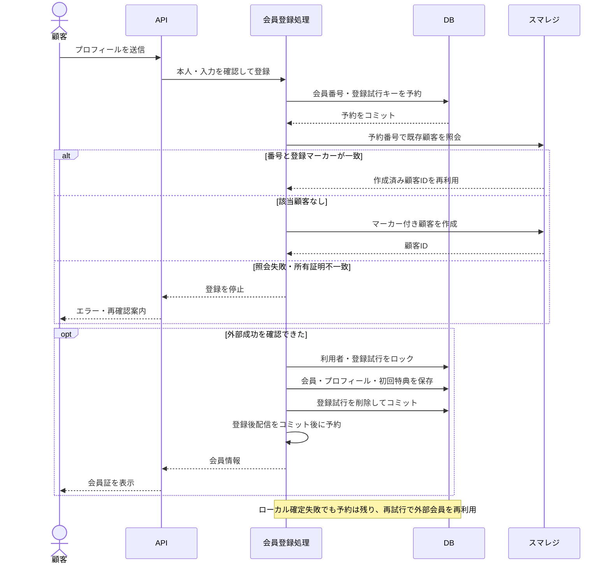
```mermaid
sequenceDiagram
    actor C as 顧客
    participant A as API
    participant M as 会員登録処理
    participant D as DB
    participant S as スマレジ
    C->>A: プロフィールを送信
    A->>M: 本人・入力を確認して登録
    M->>D: 会員番号・登録試行キーを予約
    D-->>M: 予約をコミット
    M->>S: 予約番号で既存顧客を照会
    alt 番号と登録マーカーが一致
        S-->>M: 作成済み顧客IDを再利用
    else 該当顧客なし
        M->>S: マーカー付き顧客を作成
        S-->>M: 顧客ID
    else 照会失敗・所有証明不一致
        M-->>A: 登録を停止
        A-->>C: エラー・再確認案内
    end
    opt 外部成功を確認できた
        M->>D: 利用者・登録試行をロック
        M->>D: 会員・プロフィール・初回特典を保存
        M->>D: 登録試行を削除してコミット
        M->>M: 登録後配信をコミット後に予約
        M-->>A: 会員情報
        A-->>C: 会員証を表示
    end
    Note over M,D: ローカル確定失敗でも予約は残り、再試行で外部会員を再利用
```


<a id="sequences-02"></a>

### S02 現金注文

対応：[注文](#store-flows-01)。現金の抽選権利は作成時ではなく完了時です。

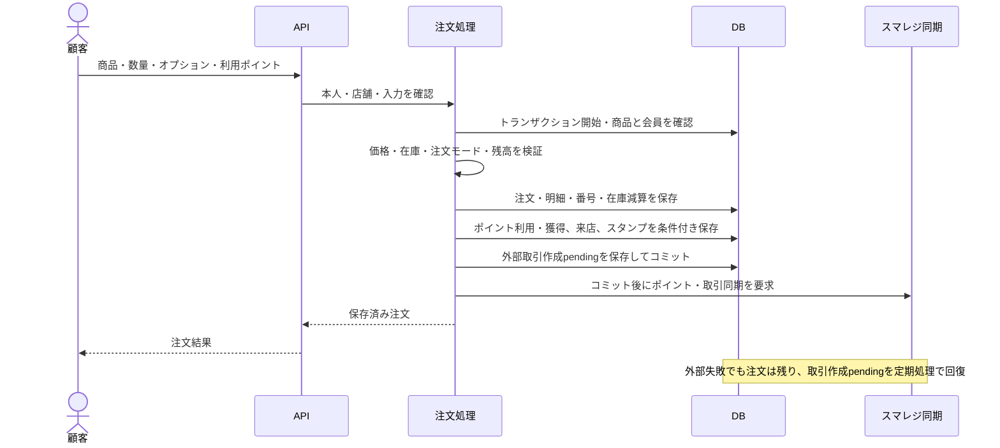
```mermaid
sequenceDiagram
    actor C as 顧客
    participant A as API
    participant O as 注文処理
    participant D as DB
    participant S as スマレジ同期
    C->>A: 商品・数量・オプション・利用ポイント
    A->>O: 本人・店舗・入力を確認
    O->>D: トランザクション開始・商品と会員を確認
    O->>O: 価格・在庫・注文モード・残高を検証
    O->>D: 注文・明細・番号・在庫減算を保存
    O->>D: ポイント利用・獲得、来店、スタンプを条件付き保存
    O->>D: 外部取引作成pendingを保存してコミット
    O->>S: コミット後にポイント・取引同期を要求
    O-->>A: 保存済み注文
    A-->>C: 注文結果
    Note over D,S: 外部失敗でも注文は残り、取引作成pendingを定期処理で回復
```


<a id="sequences-03"></a>

### S03 Stripe注文と二つの決済確定経路

対応：[決済](#store-flows-02)。図はIntent経路で、Checkoutの画面遷移は省略しています。

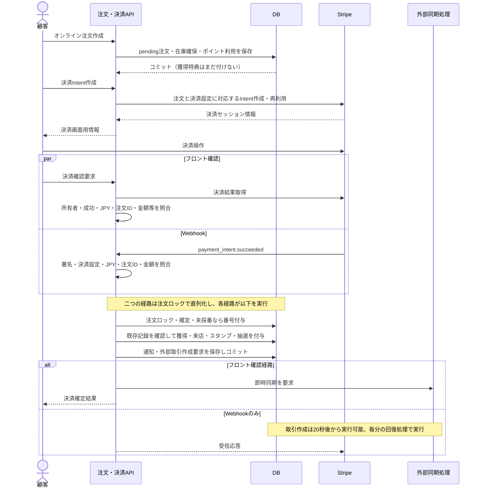
```mermaid
sequenceDiagram
    actor C as 顧客
    participant A as 注文・決済API
    participant D as DB
    participant S as Stripe
    participant X as 外部同期処理
    C->>A: オンライン注文作成
    A->>D: pending注文・在庫確保・ポイント利用を保存
    D-->>A: コミット（獲得特典はまだ付けない）
    C->>A: 決済Intent作成
    A->>S: 注文と決済設定に対応するIntent作成・再利用
    S-->>A: 決済セッション情報
    A-->>C: 決済画面用情報
    C->>S: 決済操作
    par フロント確認
        C->>A: 決済確認要求
        A->>S: 決済結果取得
        A->>A: 所有者・成功・JPY・注文ID・金額等を照合
    and Webhook
        S->>A: payment_intent.succeeded
        A->>A: 署名・決済設定・JPY・注文ID・金額を照合
    end
    Note over A,D: 二つの経路は注文ロックで直列化し、各経路が以下を実行
    A->>D: 注文ロック・確定・未採番なら番号付与
    A->>D: 既存記録を確認して獲得・来店・スタンプ・抽選を付与
    A->>D: 通知・外部取引作成要求を保存しコミット
    alt フロント確認経路
        A->>X: 即時同期を要求
        A-->>C: 決済確定結果
    else Webhookのみ
        Note over D,X: 取引作成は20秒後から実行可能、毎分の回復処理で実行
        A-->>S: 受信応答
    end
```


<a id="sequences-04"></a>

### S04 未決済Stripe注文の取消

対応：[未決済取消](#store-flows-02)。外部セッションとローカルDBを一体でコミットする図ではありません。

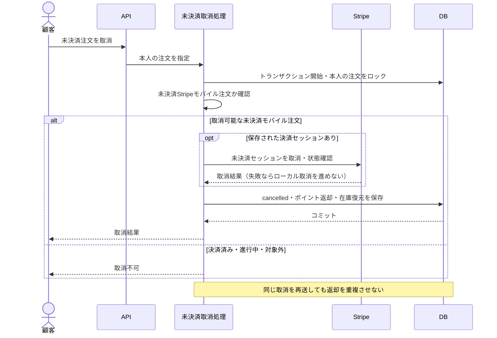
```mermaid
sequenceDiagram
    actor C as 顧客
    participant A as API
    participant U as 未決済取消処理
    participant S as Stripe
    participant D as DB
    C->>A: 未決済注文を取消
    A->>U: 本人の注文を指定
    U->>D: トランザクション開始・本人の注文をロック
    U->>U: 未決済Stripeモバイル注文か確認
    alt 取消可能な未決済モバイル注文
        opt 保存された決済セッションあり
            U->>S: 未決済セッションを取消・状態確認
            S-->>U: 取消結果（失敗ならローカル取消を進めない）
        end
        U->>D: cancelled・ポイント返却・在庫復元を保存
        D-->>U: コミット
        U-->>C: 取消結果
    else 決済済み・進行中・対象外
        U-->>C: 取消不可
    end
    Note over U,D: 同じ取消を再送しても返却を重複させない
```


<a id="sequences-05"></a>

### S05 既存スマレジ会員の連携

対応：[既存会員連携](#members-05)。認証済み顧客の経路です。

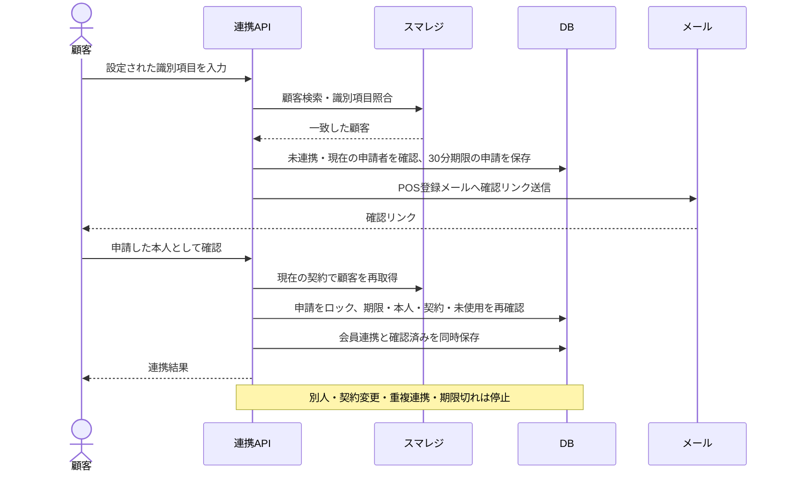
```mermaid
sequenceDiagram
    actor C as 顧客
    participant A as 連携API
    participant S as スマレジ
    participant D as DB
    participant E as メール
    C->>A: 設定された識別項目を入力
    A->>S: 顧客検索・識別項目照合
    S-->>A: 一致した顧客
    A->>D: 未連携・現在の申請者を確認、30分期限の申請を保存
    A->>E: POS登録メールへ確認リンク送信
    E-->>C: 確認リンク
    C->>A: 申請した本人として確認
    A->>S: 現在の契約で顧客を再取得
    A->>D: 申請をロック、期限・本人・契約・未使用を再確認
    A->>D: 会員連携と確認済みを同時保存
    A-->>C: 連携結果
    Note over A,D: 別人・契約変更・重複連携・期限切れは停止
```


<a id="sequences-06"></a>

### S06 退会

対応：[退会](#members-05)。外部処理がDBロック中に実行される経路です。

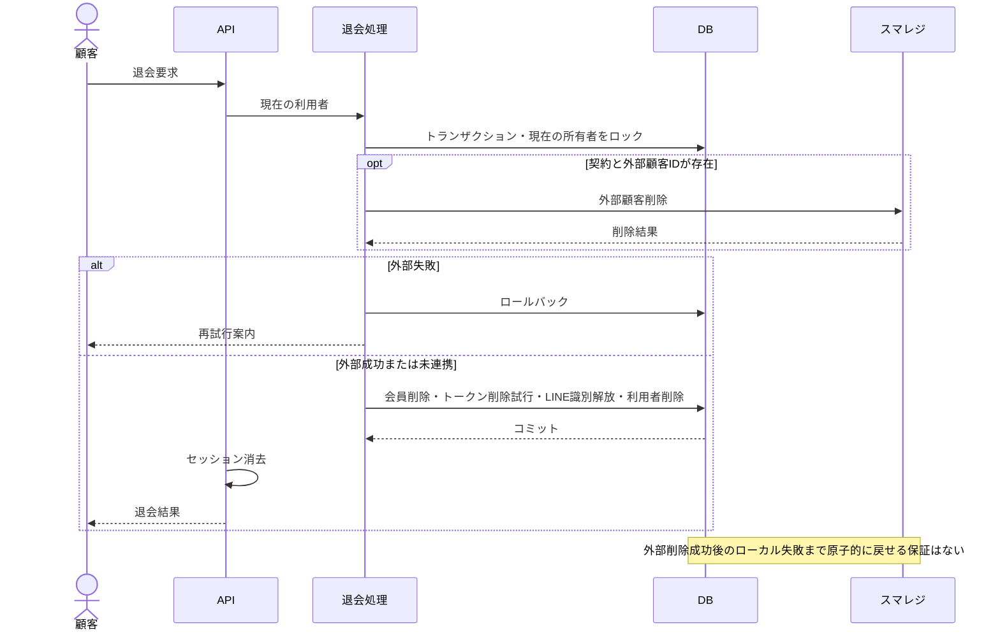
```mermaid
sequenceDiagram
    actor C as 顧客
    participant A as API
    participant W as 退会処理
    participant D as DB
    participant S as スマレジ
    C->>A: 退会要求
    A->>W: 現在の利用者
    W->>D: トランザクション・現在の所有者をロック
    opt 契約と外部顧客IDが存在
        W->>S: 外部顧客削除
        S-->>W: 削除結果
    end
    alt 外部失敗
        W->>D: ロールバック
        W-->>C: 再試行案内
    else 外部成功または未連携
        W->>D: 会員削除・トークン削除試行・LINE識別解放・利用者削除
        D-->>W: コミット
        A->>A: セッション消去
        A-->>C: 退会結果
    end
    Note over D,S: 外部削除成功後のローカル失敗まで原子的に戻せる保証はない
```


<a id="sequences-07"></a>

### S07 予約の空き確認と確定

対応：[予約](#store-flows-03)。空き枠取得と登録は別のリクエストです。

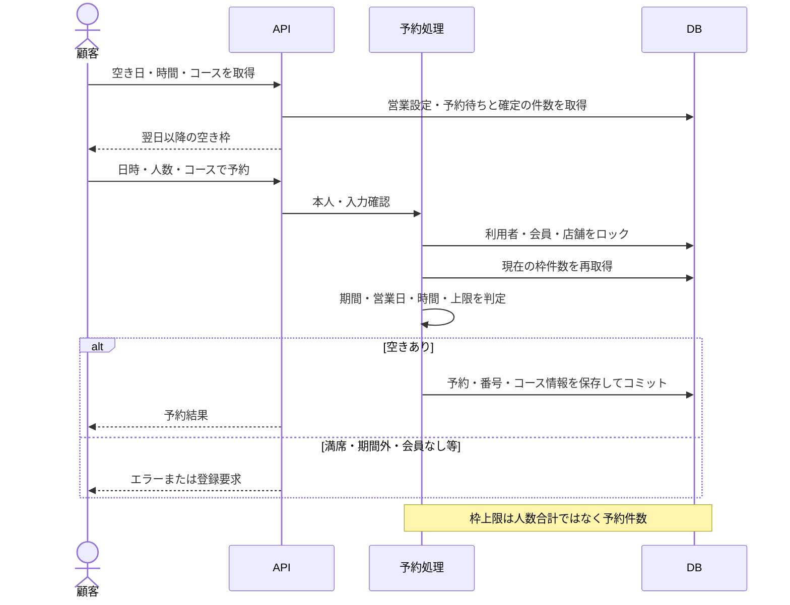
```mermaid
sequenceDiagram
    actor C as 顧客
    participant A as API
    participant R as 予約処理
    participant D as DB
    C->>A: 空き日・時間・コースを取得
    A->>D: 営業設定・予約待ちと確定の件数を取得
    A-->>C: 翌日以降の空き枠
    C->>A: 日時・人数・コースで予約
    A->>R: 本人・入力確認
    R->>D: 利用者・会員・店舗をロック
    R->>D: 現在の枠件数を再取得
    R->>R: 期間・営業日・時間・上限を判定
    alt 空きあり
        R->>D: 予約・番号・コース情報を保存してコミット
        A-->>C: 予約結果
    else 満席・期間外・会員なし等
        A-->>C: エラーまたは登録要求
    end
    Note over R,D: 枠上限は人数合計ではなく予約件数
```


<a id="sequences-08"></a>

### S08 順番待ち受付から呼出・入店

対応：[順番待ち](#store-flows-04)。通知は状態保存後です。

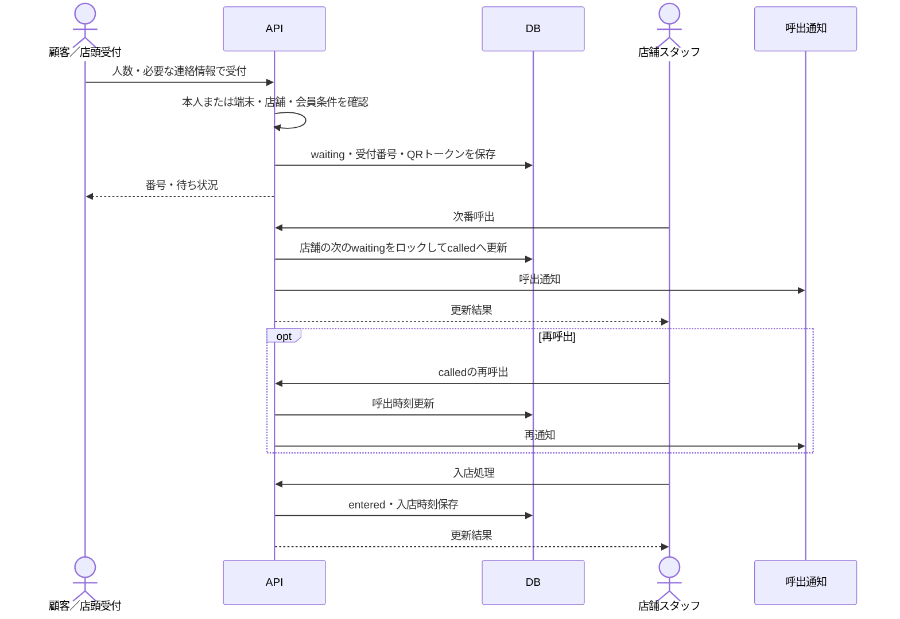
```mermaid
sequenceDiagram
    actor C as 顧客／店頭受付
    participant A as API
    participant D as DB
    actor T as 店舗スタッフ
    participant N as 呼出通知
    C->>A: 人数・必要な連絡情報で受付
    A->>A: 本人または端末・店舗・会員条件を確認
    A->>D: waiting・受付番号・QRトークンを保存
    A-->>C: 番号・待ち状況
    T->>A: 次番呼出
    A->>D: 店舗の次のwaitingをロックしてcalledへ更新
    A->>N: 呼出通知
    A-->>T: 更新結果
    opt 再呼出
        T->>A: calledの再呼出
        A->>D: 呼出時刻更新
        A->>N: 再通知
    end
    T->>A: 入店処理
    A->>D: entered・入店時刻保存
    A-->>T: 更新結果
```


<a id="sequences-09"></a>

### S09 店舗iPadの登録

対応：[店舗端末](#store-flows-05)。登録管理者の権限は継続して照合します。

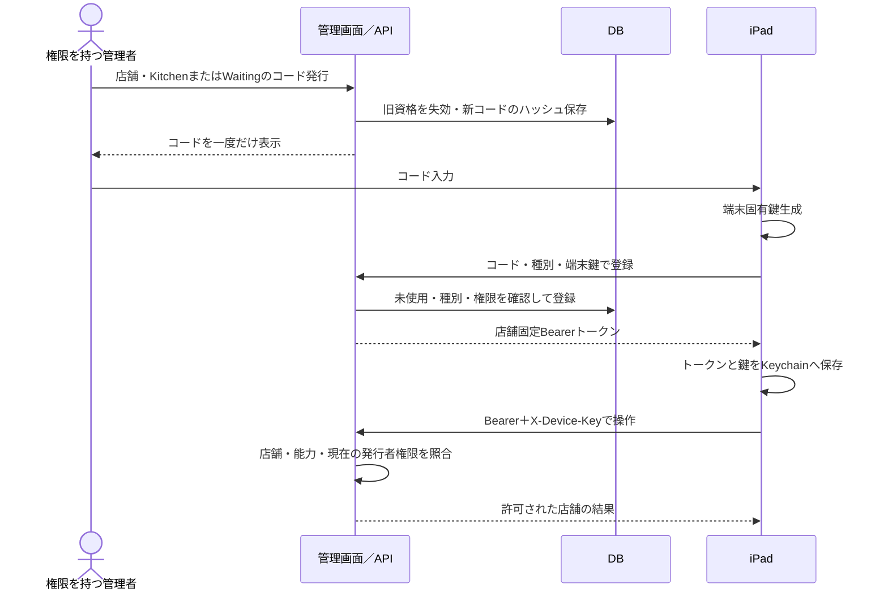
```mermaid
sequenceDiagram
    actor M as 権限を持つ管理者
    participant A as 管理画面／API
    participant D as DB
    participant T as iPad
    M->>A: 店舗・KitchenまたはWaitingのコード発行
    A->>D: 旧資格を失効・新コードのハッシュ保存
    A-->>M: コードを一度だけ表示
    M->>T: コード入力
    T->>T: 端末固有鍵生成
    T->>A: コード・種別・端末鍵で登録
    A->>D: 未使用・種別・権限を確認して登録
    A-->>T: 店舗固定Bearerトークン
    T->>T: トークンと鍵をKeychainへ保存
    T->>A: Bearer＋X-Device-Keyで操作
    A->>A: 店舗・能力・現在の発行者権限を照合
    A-->>T: 許可された店舗の結果
```


<a id="sequences-10"></a>

### S10 スタンプ達成と会計取消

対応：[スタンプ](#benefits-01)。POS会計由来の概念図です。

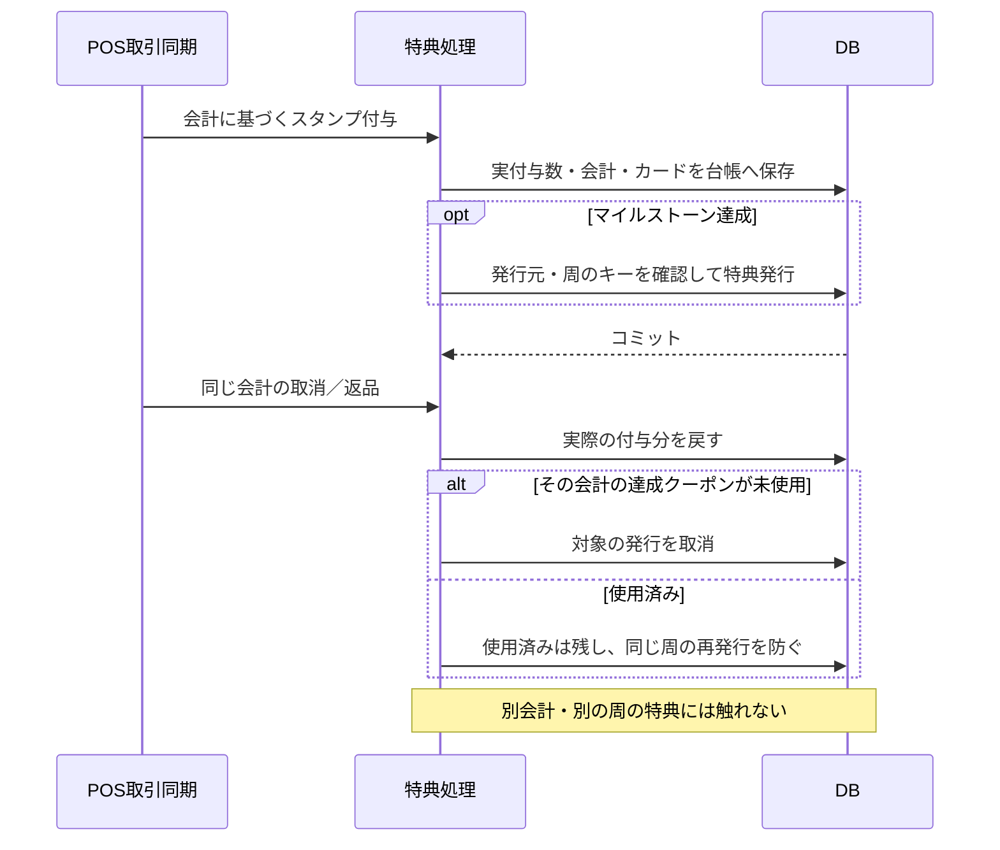
```mermaid
sequenceDiagram
    participant S as POS取引同期
    participant B as 特典処理
    participant D as DB
    S->>B: 会計に基づくスタンプ付与
    B->>D: 実付与数・会計・カードを台帳へ保存
    opt マイルストーン達成
        B->>D: 発行元・周のキーを確認して特典発行
    end
    D-->>B: コミット
    S->>B: 同じ会計の取消／返品
    B->>D: 実際の付与分を戻す
    alt その会計の達成クーポンが未使用
        B->>D: 対象の発行を取消
    else 使用済み
        B->>D: 使用済みは残し、同じ周の再発行を防ぐ
    end
    Note over B,D: 別会計・別の周の特典には触れない
```


<a id="sequences-11"></a>

### S11 クーポン利用

対応：[クーポン](#benefits-02)。発行処理とは別です。

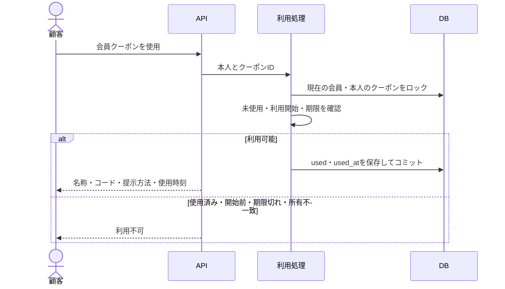
```mermaid
sequenceDiagram
    actor C as 顧客
    participant A as API
    participant U as 利用処理
    participant D as DB
    C->>A: 会員クーポンを使用
    A->>U: 本人とクーポンID
    U->>D: 現在の会員・本人のクーポンをロック
    U->>U: 未使用・利用開始・期限を確認
    alt 利用可能
        U->>D: used・used_atを保存してコミット
        A-->>C: 名称・コード・提示方法・使用時刻
    else 使用済み・開始前・期限切れ・所有不一致
        A-->>C: 利用不可
    end
```


<a id="sequences-12"></a>

### S12 抽選と演出後の通知

対応：[抽選](#benefits-03)。結果はサーバーで確定します。

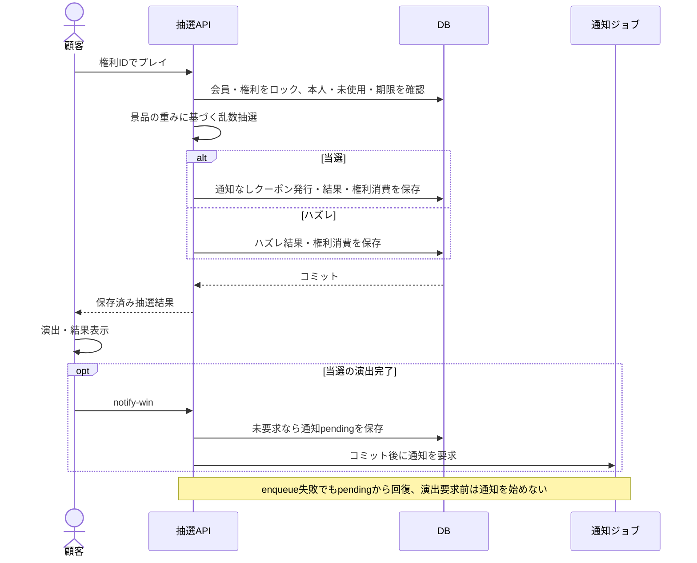
```mermaid
sequenceDiagram
    actor C as 顧客
    participant A as 抽選API
    participant D as DB
    participant N as 通知ジョブ
    C->>A: 権利IDでプレイ
    A->>D: 会員・権利をロック、本人・未使用・期限を確認
    A->>A: 景品の重みに基づく乱数抽選
    alt 当選
        A->>D: 通知なしクーポン発行・結果・権利消費を保存
    else ハズレ
        A->>D: ハズレ結果・権利消費を保存
    end
    D-->>A: コミット
    A-->>C: 保存済み抽選結果
    C->>C: 演出・結果表示
    opt 当選の演出完了
        C->>A: notify-win
        A->>D: 未要求なら通知pendingを保存
        A->>N: コミット後に通知を要求
    end
    Note over A,N: enqueue失敗でもpendingから回復、演出要求前は通知を始めない
```


<a id="sequences-13"></a>

### S13 定期配信予定の実行

対応：[配信](#benefits-04)。登録後「分」やランク到達の経路とは別です。

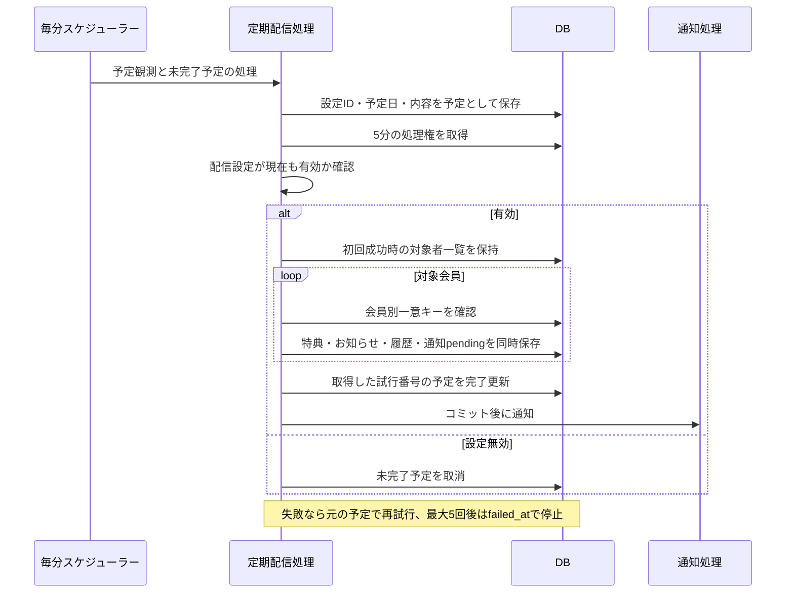
```mermaid
sequenceDiagram
    participant S as 毎分スケジューラー
    participant P as 定期配信処理
    participant D as DB
    participant N as 通知処理
    S->>P: 予定観測と未完了予定の処理
    P->>D: 設定ID・予定日・内容を予定として保存
    P->>D: 5分の処理権を取得
    P->>P: 配信設定が現在も有効か確認
    alt 有効
        P->>D: 初回成功時の対象者一覧を保持
        loop 対象会員
            P->>D: 会員別一意キーを確認
            P->>D: 特典・お知らせ・履歴・通知pendingを同時保存
        end
        P->>D: 取得した試行番号の予定を完了更新
        P->>N: コミット後に通知
    else 設定無効
        P->>D: 未完了予定を取消
    end
    Note over P,D: 失敗なら元の予定で再試行、最大5回後はfailed_atで停止
```

`held` は予約お知らせ等の実行時権限確認に使う状態であり、この定期配信予定の無効化と同じ処理ではありません。


<a id="sequences-14"></a>

### S14 通知の失敗回復

対応：[配信](#benefits-04)。クーポンとお知らせの共通パターンを示します。

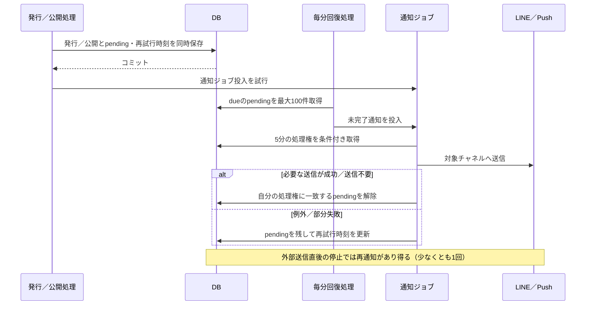
```mermaid
sequenceDiagram
    participant B as 発行／公開処理
    participant D as DB
    participant S as 毎分回復処理
    participant J as 通知ジョブ
    participant E as LINE／Push
    B->>D: 発行／公開とpending・再試行時刻を同時保存
    D-->>B: コミット
    B->>J: 通知ジョブ投入を試行
    S->>D: dueのpendingを最大100件取得
    S->>J: 未完了通知を投入
    J->>D: 5分の処理権を条件付き取得
    J->>E: 対象チャネルへ送信
    alt 必要な送信が成功／送信不要
        J->>D: 自分の処理権に一致するpendingを解除
    else 例外／部分失敗
        J->>D: pendingを残して再試行時刻を更新
    end
    Note over D,E: 外部送信直後の停止では再通知があり得る（少なくとも1回）
```


<a id="sequences-15"></a>

### S15 スマレジからの会計同期

対応：[外部連携](#benefits-05)。通知種別に応じた処理のうち、会計経路を要約しています。

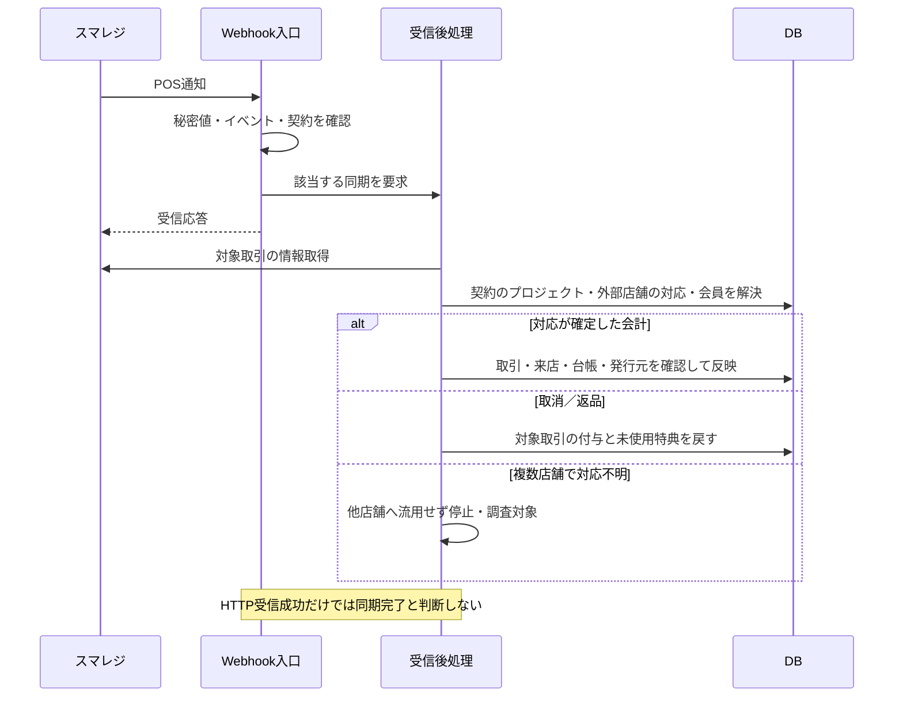
```mermaid
sequenceDiagram
    participant S as スマレジ
    participant A as Webhook入口
    participant J as 受信後処理
    participant D as DB
    S->>A: POS通知
    A->>A: 秘密値・イベント・契約を確認
    A->>J: 該当する同期を要求
    A-->>S: 受信応答
    J->>S: 対象取引の情報取得
    J->>D: 契約のプロジェクト・外部店舗の対応・会員を解決
    alt 対応が確定した会計
        J->>D: 取引・来店・台帳・発行元を確認して反映
    else 取消／返品
        J->>D: 対象取引の付与と未使用特典を戻す
    else 複数店舗で対応不明
        J->>J: 他店舗へ流用せず停止・調査対象
    end
    Note over A,J: HTTP受信成功だけでは同期完了と判断しない
```


<a id="sequences-16"></a>

### S16 新規導入のメール登録

対応：[新規導入](#benefits-05)。今回の導入画面変更を含みます。

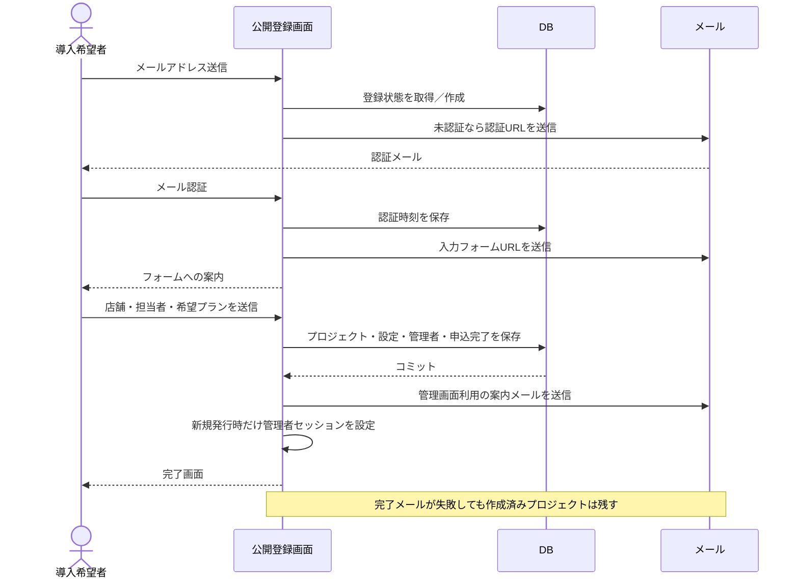
```mermaid
sequenceDiagram
    actor C as 導入希望者
    participant A as 公開登録画面
    participant D as DB
    participant E as メール
    C->>A: メールアドレス送信
    A->>D: 登録状態を取得／作成
    A->>E: 未認証なら認証URLを送信
    E-->>C: 認証メール
    C->>A: メール認証
    A->>D: 認証時刻を保存
    A->>E: 入力フォームURLを送信
    A-->>C: フォームへの案内
    C->>A: 店舗・担当者・希望プランを送信
    A->>D: プロジェクト・設定・管理者・申込完了を保存
    D-->>A: コミット
    A->>E: 管理画面利用の案内メールを送信
    A->>A: 新規発行時だけ管理者セッションを設定
    A-->>C: 完了画面
    Note over A,E: 完了メールが失敗しても作成済みプロジェクトは残す
```


<a id="sequences-17"></a>

### 図を読んだ後に確認すること

DBのコミットは、その区間のローカル保存が確定した意味です。外部APIとDBの完全な一体コミットを意味しません。イベント・キューには同期実行設定の経路もあるため、図の別参加者が必ず別プロセスで動くとも限りません。例外の正確な応答とAPIごとの認証条件は、対応するController・FormRequest・Middlewareを参照してください。

